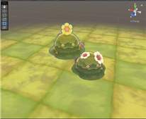

# 프로젝트명: Dungeon Breaker - 박종현

# [컨셉]

## 메인컨셉 : 컨트롤

- 컨트롤을 통해서 적들의 공격을 피하고 패턴을 공략하여 공격함으로써 스릴감을 느낄 수 있도록 할 것입니다.

### 서브 컨세 1 : 화려함

- 다양한 스킬을 통해서 컨트롤을 통한 즐거움말고도 눈으로 보는 즐거움 또한 줄 것입니다.

### 서브 컨세 2 : 타격감

- 적들을 타격시 타격 이펙트와 동시 화면이 흔들리는 효과와 타격음을 통해 좀더 생동감있는 타격감을 줄 것입니다.

### 서브 컨세 3 : 운

- 적 처치를 통해 얻는 전리품의 등급을 나누어 좋은 전리품을 획득시에 플레이어에게 짜릿함을 줍니다.

### 서브 컨세 4 : 성장

- 처음부터 강한 캐릭터를 컨트롤하는 것이 아니라 적들을 물리치고 경험치와 아이템을 통해 점차 다양한 스킬과 능력치들을 얻으며 성취감을 느낄 수 있습니다.

### 서브 컨세 5 : 귀여움

- SD캐릭터와 같은 비율로 너무 사실적인 그래픽이 아니라 사람들의 거부감을 줄일 수 있으며, 아기자기한 캐릭터로 다양한 액션을 통해 반전매력을 느낄 수 있도록 할 수 있습니다.

  

# [관련 이미지 & 동영상]

- 이미지
   
  - 보스의 패턴이 미리 표시되고 플레이어는 이를 보고 미리 회피기를 통해 회피를 하며 보스의 패턴을 공략하고 컨트롤하여 공격하는 플레이를 할 수 있습니다.
  
  
  - 던전이라는 어두운 이미지의 게임이라 생각할 수 있지만 캐릭터는 SD캐릭터와 같은 캐릭터로 반전매력을 느낄 수 있습니다.
     
  
- 동영상
   
  ▼클릭 
  

  

# [대표 이미지]

  

# [컨셉 & 대표이미지 기반 작품묘사]

> ### 대표이미지 기반 :

> ### 컨셉 기반:

  

# [<Dungeon Breaker> Dungeon Breaker 구성 요소]

 

## 1. 메커니즘

[도전 과제]

1. 몬스터들을 처치하며 보스 몬스터까지 도달
2. 보스 몬스터의 패턴을 파훼하고 처치
3. 일정시간 내에 보스몬스터를 처치 못하거나 사망시에 실패

[재미 요소]

1. 몬스터를 처치하고 레벨업하여 자신의 스킬을 강화한다.
2. 다양한 스킬들을 활용하여 몬스터를 처치한다.
3. 보스의 공격을 회피기로 피하고 스킬을 이용하여 공격하며 컨트롤한다.
4. 보스를 처치 후 확률적으로 더 좋은 보상을 얻을 수 있다.

 

## 2. 이야기

[만들게 된 배경]   
- 과거 재밌게 플레이했던 던전스트라이커라는 게임을 추억하였고, 이를 통해 아기자기한 캐릭터를 조작하지만 게임의 배경은 귀여운 캐릭터와는 달리 어두운 배경의 게임을 만들어보고 싶었습니다. 
- SD캐릭터는 보통 간단하고 쉬운 게임에 사용되지만 이 게임에는 컨트롤이라는 요소를 추가하여 사람들이 플레이를 하며 긴장감을 느끼고 컨트롤하는 재미를 느낄 수 있도록 하고 싶었습니다.
  
[참신함]  
- 보통 SD캐릭터와 같이 귀여운 캐릭터는 누구나 쉽게 접근할 수 있고 플레이도 쉬운 게임에 사용되는데, 이 게임의 경우 접근이 쉬울 수는 있으나 간단하게 즐기는 것이 아니라 여러 번의 플레이를 통해 플레이어가 컨트롤을 연습하여 던전을 클리어하는 게임이다.
  
[카메라 관점]  
- 쿼터뷰로 설정하고 카메라가 플레이어의 움직임을 따라가도록 한다.

 

## 3. 미적요소

[디자인]  
캐릭터와 몬스터의 경우 SD캐릭터와 같이 2등신 캐릭터로 디자인
마을은 거대한 성이 있는 마을, 던전은 어두운 숲, 지하의 감옥, 광산 등으로 마을과는 상반되는 모습으로 디자인
 
[컬러]  
스킬 사용시 나오는 이펙트에 화려한 색감을 준다.
 
[음향]  
스킬마다 다양한 음향을 적용하여 스킬을 시전하거나  몬스터 타격시 음향을 들려준다.
마을에 있을때는 평화로는 배경음, 던전에 입장시에는 긴장감을 느낄 수 있도록 어두운 느낌이 배경을을 재생한다.
 

## 4. 기술

Unity를 기반으로 제작할 예정이다.

  

# [<Dungeon Breaker> 게임시스템디자인]

 

## 1. 게임 오브젝트 분해

 

| 연번 | 오브젝트 이름  | 오브젝트 이미지 |
|:----:|:----:|:----:|
| 1 | 플레이어 |  |
| 2 | 보스1 |  |
| 3 | 몬스터1 |  |
| 4 | 몬스터2 |  |
| 5 | 몬스터3 |  |
| 6 | 보스2 |  |
| 7 | 몬스터4 |  |
| 8 | 몬스터5 |  |
| 9 | 몬스터6 |  |
| 10 | 상자 |  |
| 11 | 검 |  |
| 12 | 갑옷 |  |
| 13 | 물약 |  |
| 14 | 코인 |  |
| 15 | 상점 |  |
| 16 | 포탈 |  |
| 17 | 플레이어 체력UI |  |
| 18 | 스킬UI |  |
| 19 | 물약UI |  |
| 20 | 코인UI |  |
| 21 | BGM |  |
| 22 | 인벤토리 |  |
| 23 | 스킬 창 |  |
| 24 | 타이머 |  |
| 25 | 던전선택UI |  |
| 26 | 베기 이펙트 |  |
| 27 | 스킬 이펙트 |  |
| 28 | 폰트 |  |
| 29 | 미션UI |  |
| 30 | 퀘스트 창 |  |
| 31 | 로딩 창 |  |
| 32 | 스카이박스 |  |
| 33 | 마을 |  |
| 34 | 던전 |  |
| 35 | NPC |  |

 

## 2. 파라미터(속성) 뽑아 보기

 

1\) 오브젝트 이름 : 플레이어
   
| 속성 | 영문명칭  | 설명 | 비고 |
|:----:|:----:|:----:|:----:|
| 이름 | p_Name | 플레이어의 이름 ||
| 레벨 | p_Lv | 플레이어의 레벨 ||
| 경험치 | p_Exp | 플레이어의 경험치 ||
| 체력 | p_Hp | 플레이어의 체력 수치 ||
| 속도 | p_Speed |플레이어의 이동속도 ||
| 공격력 | p_Atk | 플레이어의 공격력 수치 ||
| 상태 | p_State | 플레이어의 상태 – 대기, 이동, 대쉬, 공격, 빈사상태 등 ||
| 사운드 | p_Sound | 플레이어의 사운드 – 이동, 달리기, 대쉬, 공격, 스킬 등 ||

 

2\) 오브젝트 이름 : 보스, 몬스터1, 몬스터2, 몬스터3, 보스2, 몬스터4, 몬스터5, 몬스터6
  
| 속성 | 영문명칭  | 설명 | 비고 |
|:----:|:----:|:----:|:----:|
| 이름 | e_Name | 몬스터의 이름 ||
| 체력 | e_Hp | 몬스터의 체력 수치 ||
| 속도 | e_Speed |몬스터의 이동속도 ||
| 공격력 | e_Atk | 몬스터의 공격력 수치 ||
| 상태 | e_State | 몬스터의 상태 – 대기, 이동, 공격, 죽음 ||
| 사운드 | e_Sound | 몬스터의 사운드 – 공격, 죽음 ||

 

3\) 오브젝트 이름 : 상자
  
| 속성 | 영문명칭  | 설명 | 비고 |
|:----:|:----:|:----:|:----:|
| 이름 | b_Name | 상자의 이름 ||
| 열기 | b_Open | 플레이어가 상자와 상호작용 시 상자 열림 ||
| 드랍 | b_Drop | 상자가 열리면 아이템을 드랍함 ||
| 사운드 | b_Sound | 상자가 열릴 때 사운드 ||

 

4\) 오브젝트 이름 : 검, 갑옷
  
| 속성 | 영문명칭  | 설명 | 비고 |
|:----:|:----:|:----:|:----:|
| 이름 | i_Name | 아이템의 이름 ||
| 획득 | i_Get | 검이나 갑옷을 획득할 시 인벤토리 안으로 들어감 ||
| 정보 | i_Info | 아이템의 정보 ||
| 사용 | i_Equip | 플레이어에게 장착 ||
| 공격력 | s_Atk | 장착 시 플레이어의 공격력 상승량 | 검 |
| 체력 | a_Hp | 장착 시 플레이어의 체력 상승량 | 갑옷 |

 

5\) 오브젝트 이름 : 코인, 코인UI
  
| 속성 | 영문명칭  | 설명 | 비고 |
|:----:|:----:|:----:|:----:|
| 이름 | i_Name | 아이템의 이름 ||
| 정보 | i_Info | 아이템의 정보 ||
| 획득 | c_Get | 코인을 획득할 시 코인UI의 코인 수 증가 ||
| 사용 | c_Use | 상점에서 아이템 구매시 사용 사용시 코인UI의 코인 수 감소 ||
| 개수 | c_Amount | 플레이어가 가지고 있는 코인의 개수 표시 | 코인UI |
| 사운드 | c_Sound | 코인을 획득 시 사운드 ||

 

6\) 오브젝트 이름 : 물약, 물약UI
  
| 속성 | 영문명칭  | 설명 | 비고 |
|:----:|:----:|:----:|:----:|
| 이름 | i_Name | 아이템의 이름 ||
| 정보 | i_Info | 아이템의 정보 ||
| 획득 | l_Get | 물약을 획득 시 인벤토리 안으로 들어간다 물약UI의 물약 수 증가 ||
| 사용 | l_Use | 물약 사용 시 플레이어 Hp 회복 ||
| 회복량 | l_Amount | 물약 사용시 플레이어의 Hp 회복량 ||
| 사운드 | l_Sound | 물약 사용 시 사운드 ||
| 이펙트 | l_Effect | 물약 사용 시 이펙트 ||

 

7\) 오브젝트 이름 : 포탈
  
| 속성 | 영문명칭  | 설명 | 비고 |
|:----:|:----:|:----:|:----:|
| 충돌 | p_Trigger | 플레이어가 포탈에 닿을 시 다른 맵으로 입장 ||

 

8\) 오브젝트 이름 : 스킬UI
  
| 속성 | 영문명칭  | 설명 | 비고 |
|:----:|:----:|:----:|:----:|
| 쿨타임 | s_Cool | 스킬을 사용 후 재사용까지의 대기시간 ||
| 정보 | s_Info | 스킬UI에 마우스를 가져다 놓을시 스킬정보 UI가 나옴 ||
| 공격력 | s_Atk | 스킬의 공격력 수치 ||

 

9\) 오브젝트 이름 : NPC(주민, 상점)
  
| 속성 | 영문명칭  | 설명 | 비고 |
|:----:|:----:|:----:|:----:|
| 이름 | npc_Name | 상점 NPC의 이름 ||
| 퀘스트 | npc_Quest | 퀘스트 의뢰 |주민|
| 구매 | npc_Buy | 아이템 구매 |상점|
| 판매 | npc_Sell | 아이템 판매 |상점|

 

10\) 오브젝트 이름 : 인벤토리
  
| 속성 | 영문명칭  | 설명 | 비고 |
|:----:|:----:|:----:|:----:|
| 보관 | iv_Keep | 아이템을 획득시 인벤토리에 저장 ||
| 사용 | iv_Use | 아이템 사용시 인벤토리에서 삭제 장착 아이템일 경우 아이템에 사용중 표시 ||
| 장착 아이템 | iv_Equip | 현재 플레이어의 장착 아이템 확인 ||

 

11\) 오브젝트 이름 : 스킬창
  
| 속성 | 영문명칭  | 설명 | 비고 |
|:----:|:----:|:----:|:----:|
| 정보 | s_Info | 스킬 정보 ||

 

12\) 오브젝트 이름 : 타이머
  
| 속성 | 영문명칭  | 설명 | 비고 |
|:----:|:----:|:----:|:----:|
| 시간 | d_Time | 던전 내의 제한 시간 표시 ||
| 타임아웃 | timeOut | 제한시간 초과 시 죽음 ||

 

13\) 오브젝트 이름 : 배경음악
  
| 속성 | 영문명칭  | 설명 | 비고 |
|:----:|:----:|:----:|:----:|
| 타이틀 | title | 몽환스러운 BGM ||
| 마을 | village | 경쾌하면서 웅장한 BGM ||
| 상점 | store | 부드럽고 여유로운 BGM ||
| 던전 | dungeon | 긴장감이 느낄 수 있는 BGM ||
| 보스 | boss | 긴장감을 고조시키는 BGM ||

 

14\) 오브젝트 이름 : 던전선택UI
  
| 속성 | 영문명칭  | 설명 | 비고 |
|:----:|:----:|:----:|:----:|
| 정보 | d_Info | 던전 정보 ||

 

15\) 오브젝트 이름 : 베기, 스킬 이펙트
  
| 속성 | 영문명칭  | 설명 | 비고 |
|:----:|:----:|:----:|:----:|
| 이펙트 | atk_Effect | 베기, 스킬 이펙트 ||

 

16\) 오브젝트 이름 : 미션 UI
  
| 속성 | 영문명칭  | 설명 | 비고 |
|:----:|:----:|:----:|:----:|
| 정보 | mission_Info | 다음 맵을 넘어가기 위한 던전 내의 임무에 대한 정보 ||

 

17\) 오브젝트 이름 : 퀘스트 창
  
| 속성 | 영문명칭  | 설명 | 비고 |
|:----:|:----:|:----:|:----:|
| 정보 | quest_Info | 퀘스트 정보 ||
| 보상 | quest_Reward | 퀘스트 보상 ||

 

## 3. 행동 뽑아 보기

 

1\) 오브젝트 이름 : 플레이어
  
| 행동 | 영문명칭 | 설명 |
|:----:|:----:|:----:|
| 대기 | idle | 아무런 키도 입력 안 하고 있을시 대기 모션 재생 |
| 앞으로 이동 | f_Move | ↑키 입력 시 앞으로 이동 |
| 뒤로 이동 | b_Move | ↓키 입력 시 뒤로 이동 |
| 오른쪽 이동 | r_Move | →키 입력 시 오른쪽으로 이동 |
| 왼쪽 이동 | l_Move | ←키 입력 시 왼쪽으로 이동 |
| 앞 달리기 | f_Run | ↑키를 연속적으로 ↑↑같이 입력 시 앞으로 달리기 |
| 뒤 달리기 | b_Run | ↓키를 연속적으로 ↓↓같이 입력 시 뒤로 달리기 |
| 오른쪽 달리기 | r_Run | →키를 연속적으로 →→같이 입력 시 오른쪽으로 달리기 |
| 왼쪽 달리기 | l_Run | ←키를 연속적으로 ←←같이 입력 시 왼쪽으로 달리기 |
| 대쉬 | dash | space 키(대쉬 키)를 입력 시 플레이어가 보고 있는 방향으로 순간적인 속도로 빠르게 이동 |
| 공격 | attack | x 키(공격 키) 입력 시 공격 모션 재생 |
| 스킬 | skill | 스킬키 입력 시 사용 스킬에 맞는 모션 재생 |
| 피격 | hit | 몬스터에게 피격 시 피격모션 재생 |
| 죽음 | death | 던전 제한시간 초과 or 플레이어의 Hp가 0이 될 시에 죽는 모션 재생 |
| 승리 | win | 던전 클리어 시에 승리 모션 재생 |

 

2\) 오브젝트 이름 : 보스, 몬스터1, 몬스터2, 몬스터3, 보스2, 몬스터4, 몬스터5, 몬스터6
  
| 행동 | 영문명칭 | 설명 |
|:----:|:----:|:----:|
| 대기 | idle | 어떠한 행동도 안할 시에 대기 모션 재생 |
| 이동 | move | 이동 |
| 공격 | attack | 플레이어 발견시에 공격 |
| 피격 | hit | 공격을 받을시에 피격 모션을 재생 및 색이 잠시 붉게 변화하고 원래대로 돌아옴 |
| 죽음 | death | 몬스터의Hp가 0이될시에 죽는 모션 재생 |

 

## 4. 상태 뽑아 보기

 

1\) 오브젝트 이름 : 플레이어
  
| 현상태 | 전이상태 | 전이조건 |
|:----:|:----:|:----:|
| 대기 | 이동 | ←, ↑, →, ↓키 입력 |
| 대기 | 달리기 | ←←, ↑↑, →→, ↓↓키 입력 |
| 대기, 이동, 달리기, 공격, 스킬 | 대쉬 | space키 입력 |
| 대기, 이동, 달리기 | 공격 | x키 입력 |
| 대기, 이동, 달리기 | 스킬 | 스킬키 입력 |
| 대기, 이동, 달리기, 대쉬, 공격, 스킬 | 죽음 | 제한시간 초과 혹은 플레이어 Hp가 0 |
| 공격, 스킬 | 승리 | 던전 클리어(보스 몬스터 처치) |
| 이동 | 달리기 | 같은 방향키를 한번 더 입력 |
| 이동, 달리기 | 대기 | 키 미입력 |
| 대기, 이동, 달리기, 공격, 스킬 | 피격 | 몬스터에게 공격 받음 |

 

2\) 오브젝트 이름 : 보스, 몬스터1, 몬스터2, 몬스터3, 보스2, 몬스터4, 몬스터5, 몬스터6
  
| 현상태 | 전이상태 | 전이조건 |
|:----:|:----:|:----:|
| 대기 | 이동 | 대기 모션과 이동 모션을 병행 재생 혹은 플레이어가 몬스터의 감지 범위 내에 들어올 시 |
| 이동 | 대기 | 대기 모션과 이동 모션을 병행 재생 |
| 대기, 이동 | 공격 | 플레이어가 몬스터의 공격 범위 내에 들어올 시 |
| 대기, 이동, 공격 | 피격 | 플레이어의 공격 혹은 스킬에 피격시 |
| 대기, 이동, 공격 | 죽음 | 몬스터의 Hp가 0이 될 시 |

 

## 5. 플레이어 캐릭터 속성(파라미터)

| 속성 | 영문명칭  | 설명 | 비고 |
|:----:|:----:|:----:|:----:|
| 이름 | p_Name | 플레이어의 이름 ||
| 레벨 | p_Lv | 플레이어의 레벨 ||
| 경험치 | p_Exp | 플레이어의 경험치 ||
| 체력 | p_Hp | 플레이어의 체력 수치 ||
| 속도 | p_Speed |플레이어의 이동속도 ||
| 공격력 | p_Atk | 플레이어의 공격력 수치 ||
| 상태 | p_State | 플레이어의 상태 – 대기, 이동, 대쉬, 공격, 빈사상태 등 ||
| 사운드 | p_Sound | 플레이어의 사운드 – 이동, 달리기, 대쉬, 공격, 스킬 등 ||

 

## 6. 게임의 규칙

 

1\) 핵심 규칙

- 플레이어는 마을에서 스폰되어 게임이 시작되며, 던전에 입장 전에 자유롭게 돌아다닐 수 있다. 
- 던전은 마을의 중심에 있는 포탈을 통해서 포탈에 다가가면 던전을 선택할 수 있는 UI가 나오며, 원하는 던전을 선택할 시에 던전으로 입장 수 있다. 
- 던전에 입장 후에는 제한시간이 생성되며, 플레이어는 이 제한 시간 안에 던전의 보스에 도달해서 보스를 잡아야 한다. 
- 처음에는 일반 몬스터들이 나오며 이들을 공격과 스킬로 처리하면 다음 맵으로 가는 포탈이 생성되고 포탈로 이동하면 다른 몬스터들이 나온다. 
- 포탈을 통해 이동하다보면 보스 맵까지 도달하게 되며 보스를 쓰러뜨리면 던전을 클리어하게 된다. 
- 보스를 클리어하면 마을로 이동하는 포탈과 아이템이 나오는 상자가 생성된다. 
- 상자를 열면 다양한 아이템이 나온다. 
- 아이템을 획득 후에는 마을로 이동하는 포탈로 마을로 돌아와 정비를 하면 된다. 

2\) 보조 규칙

- 플레이어가 던전에 도전하던 중 Hp가 0이되거나 제한시간이 초과되면 마을로 강제로 이동하게 된다.

 

## 7. 게임에서 사용될 공식
- 스테이지 내의 몬스터를 모두 처치 시에만 다음 맵(다음 스테이지 or 보스 or 마을)으로 가는 포탈이 열린다.
  

# [개발 요구사항 & 흐름도]

 

## 1. 요구사항
- 타이틀 화면, 로딩 화면, 캐릭터 선택 화면, 게임 화면 총 4종류가 있다.
- 타이틀 화면에는 시작하기, 종료하기 버튼이 있다.
- 시작하기를 누를 시 로딩 화면을 거쳐 캐릭터 선택 화면으로 넘어간다.
- 종료하기를 누를 시 게임이 종료된다.
- 캐릭터 선택 화면에서는 캐릭터를 선택할 시 캐릭터에 대한 정보와 시작하기 버튼이 나온다.
- 시작하기를 누를 시 로딩 화면을 거쳐 게임 화면(마을)으로 넘어간다.
- 게임 화면에는 캐릭터의 HP, 경험치, 스킬, 레벨, 코인 UI와 캐릭터 정보, 퀘스트, 스킬, 인벤토리, 옵션 버튼이 있다.
- 플레이어 캐릭터는 화면 중앙에 있다.
- 캐릭터 정보 버튼을 누를 시 캐릭터가 현재 착용하고 있는 장비 및 캐릭터의 능력치가 나온다.
- 퀘스트 버튼을 누를 시 현재 진행 중인 퀘스트가 나온다.
- 스킬 버튼을 누를 시 캐릭터의 스킬 정보가 나온다.
- 인벤토리 버튼을 누를 시 현재 캐릭터가 착용 중인 장비 정보와 소지 중인 아이템들이 나온다.
- 옵션 버튼을 누를 시 소리 조절 등의 기능과 게임종료 버튼이 나온다.
- 마을에는 던전으로 이동할 수 있는 포탈과 상점 그리고 NPC가 있다.
- 상점은 아이템 구매와 판매를 할 수 있다.
- 특정 NPC의 경우 퀘스트를 제공한다.
- 퀘스트는 수락할 수도 거절할 수도 있다.
- 퀘스트는 클리어할 시 정해진 보상을 얻을 수 있다.
- 던전으로 이동할 수 있는 포탈에게 다가가면 입장하고 싶은 던전을 선택할 수 있는 창이 나온다.
- 원하는 던전을 선택 시 던저의 정보와 입장하기 버튼이 있다.
- 입장하기 버튼을 누를 시 로딩 화면을 거쳐 던전으로 입장한다.
- 던전에 입장 시 오른쪽에 미션이 나오며 미션을 해결해야 다음 맵으로 가는 포탈이 열린다.
- 몬스터는 배회를 하고 있으며 플레이어가 감지 범위 내에 들어올 시 추격을 한다.
- 플레이어는 공격과 스킬을 통해 몬스터들을 공격하여 처치한다.
- 플레이어 HP가 없는 경우 물약을 통해 회복한다.
- 보스 몬스터는 배회 없이 플레이어를 항상 감지하고 추격한다.
- 보스 몬스터가 기술을 사용할 시에는 미리 공격의 경로 및 범위가 바닥에 표시된다.
- 보스 몬스터를 쓰러뜨리면 상자가 생성된다.
- 상자를 열면 랜덤으로 보상이 나온다.
- 보상에는 검, 갑옷, 물약, 코인, 경험치가 있다.
- 검, 갑옷, 물약을 획득 시에는 인벤토리 안으로 들어간다.
- 코인을 획득 시에는 코인 UI의 코인 숫자가 증가한다.
- 경험치를 획득 시에는 플레이어의 현재 경험치량이 변한다.
- 경험치가 100%가 넘을 시 플레이어의 레벨이 1 증가한다.
- 플레이어가 특정 레벨을 도달할 때 마다 새로운 스킬을 얻는다.
 

## 2. 시간별 흐름도 flowchart

 

## 3. 키보드 이벤트에 대한 흐름도

 

## 4. 용어정리

  

# [스토리보드]
